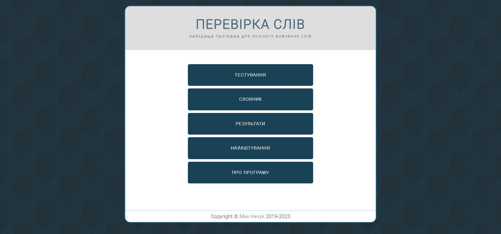
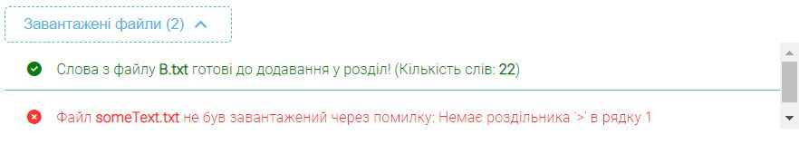

# Quiz-game

### Table of Contents

- [Demo](#demo)
- [Description](#description)
- [Installation](#installation)
- [How To Use](#how-to-use)

---

## Demo

Here is a working live demo: <a href="https://mhevyk.github.io/pure-js-quiz/">https://mhevyk.github.io/pure-js-quiz/



---

## Description

Quiz-game is a simple app for studying foreign languages. It allows us to fill in a vocabulary with words and study them, completing quizes and analysing their results.

#### Key technologies

- HTML5
- CSS3
- JS ES6+
- Webpack
- Eslint

#### Additional libraries

- <a href="https://fontawesome.com/">fontawesome</a>
- <a href="https://www.chartjs.org/docs/latest/">chart.js</a>

<p align="right">
<a href='#quiz-game'>Back To The Top</a>
</p>

---

## Installation

1. Clone the repo
   ```sh
   git clone https://github.com/mhevyk/pure-js-quiz.git
   ```
2. Install NPM packages
   ```sh
   npm install
   ```
3. Build the project
   ```sh
   npm run build
   ```
4. Run file `public/index.html` using web browser

<p align="right">
<a href='#quiz-game'>Back To The Top</a>
</p>

---

## How to use

### Adding record

Records should follow these rules:
- word must be unique
- word can`t contain a comma symbol
- translation can`t contain a comma symbol
- word and translation of a single record should not be equal
- translations of a single record should not be equal

If a word appears multiple times, it`s translations will be added to existing record's translations

### Import records

We can add multiple records using text file. To import file correctly follow these steps:
1. Select the group to which you want to add new words. If group doesn`t exist, create it.
2. Select symbol, which separates word and translations in your file. App supports separators `:`, `>` and `=`.
3. Import text file, which has a content, that corresponds the following syntax:
```
word1 <separator> translation1, translation2, ...
word2 <separator> translation1
```

Text file content should also correspond [adding record rules](#adding-record). Spaces between word, separator and translations doesn't matter.
We use a `<separator>` to separate word from translation and to separate records we need to write them from a new line.

Example of correct text file content with separator `>`:
```
apple > яблуко, яблучний
pine > груша
```

4. Open uploaded file toggler and check if file loading was succesfull


5. Submit form to add records to your vocabulary.

<p align="right">
<a href='#quiz-game'>Back To The Top</a>
</p>